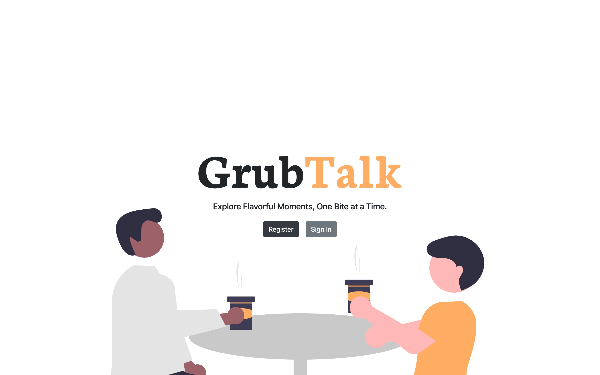
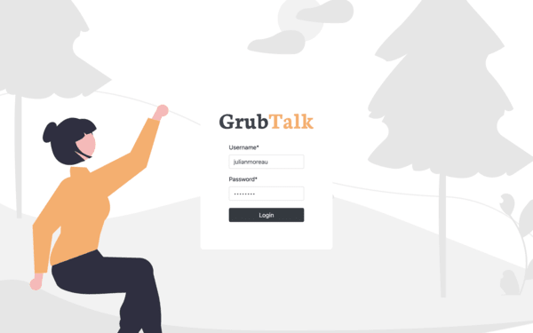
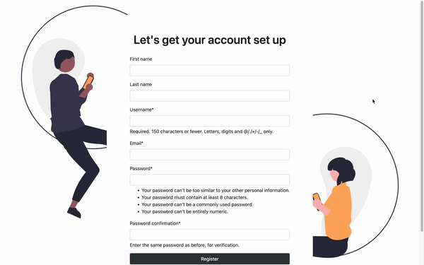
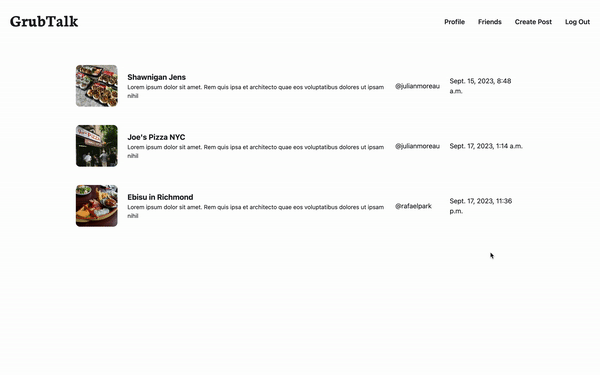
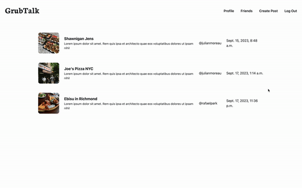

# GrubTalk
A social media photo sharing website built on [Django Framework](https://www.djangoproject.com/).

### The features avaliable to users:

- [x] Post images with a title and text description.

- [x] Users can view all posts.

- [x] Without authentication, users cannot access the main page & create/view posts.

- [x] Registeration system is complete with password reset option also available to users.

- [ ] Users have the ability to search for posts using tags and find other users by their usernames.

- [ ] Users can like & comment under someone else's post.

- [ ] Users are able to access the profiles of other users and send them friend requests.

- [ ] Use the Google API to link each post to a location.

- [ ] Deploy website.

### Technologies Used:
1. Front-End: HTML5, CSS, Bootstrap 5.2
2. Back-End: Django

### UI Design:

Frontpage:

Login:

Registration:

Homepage & Viewing Posts:

Creating Posts:

