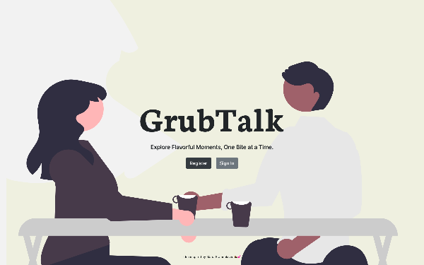
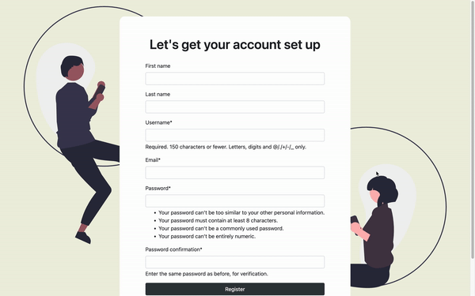
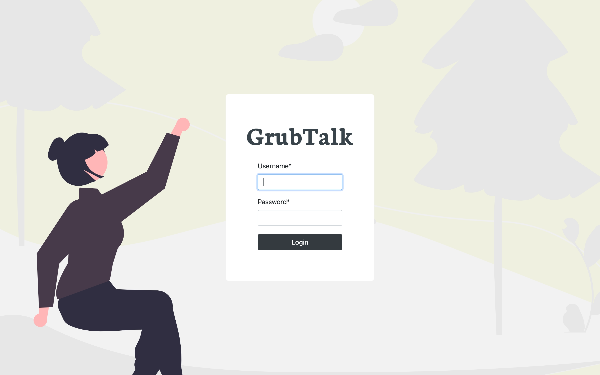
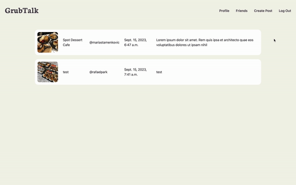

# GrubTalk - Django Social Media Application

<h3 align="center">Welcome Page</h1>

  

<h3 align="center">Registeration</h1>

  

<h3 align="center">Login</h1>

  

<h3 align="center">Main Page & Post</h1>

  

<h3 align="center">Create Post</h1>

  

